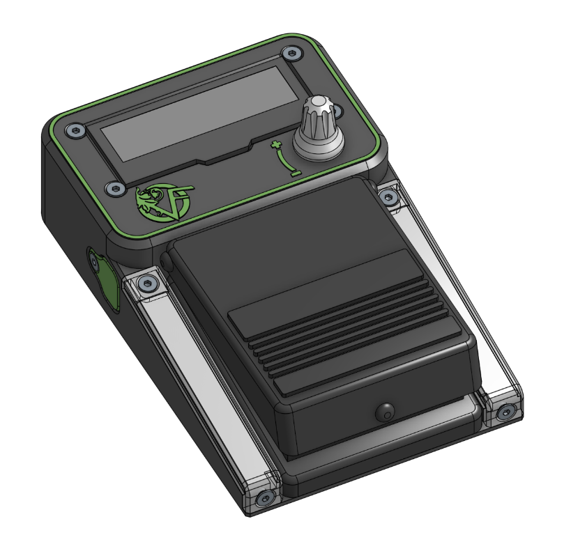

# Gig Countdown Pedal

A DIY guitar pedal for keeping track of time during live gigs. Built
around a Wemos D1 mini (ESP8266), a rotary encoder, an OLED display, and
a footswitch.

The pedal provides a configurable countdown timer, pause/resume
functionality, and overtime tracking, with visual status feedback on the
display and an addressable RGB LED strip.

## Features

-   **Configurable duration:** Set the gig duration using the rotary
    encoder, in 1-minute increments.
-   **OLED display:** Shows the countdown, paused state, and overtime.
-   **Footswitch control:** Start, pause, resume, and reset the timer
    without taking your hands off the instrument.
-   **Overtime tracking:** Automatically starts counting upward when the
    countdown reaches zero.
-   **Persistent settings:** Stores the programmed duration and LED
    brightness in EEPROM. The hidden game's high score is also saved.
-   **RGB status LEDs:** Show timer state, including a pulsing warning
    during the final five minutes.
-   **Non-blocking timer:** Uses `millis()` to track time without
    relying on long delays.
-   **Easter eggs:** A hidden game and DVD screensaver can be launched
    with the encoder button and footswitch while the timer is stopped.

## Hardware

| Component | Description |
| --- | --- |
| Microcontroller | Wemos D1 mini (ESP8266) |
| Display | 2.23-inch, 128×32 monochrome I²C OLED, SSD1305 |
| Rotary encoder | EC11 with integrated pushbutton |
| Footswitch | Roland DP-2, normally closed (cord cut and soldered) |
| RGB LEDs | 2 strips of 4 addressable RGB LEDs each, with 15 mm LED pitch; compatible with the Adafruit NeoPixel library |
| Power supply | 9 V DC input with a small buck converter to 5 V (max draw ±300 mA at 9 V) |

The OLED operates from the Wemos 3.3 V supply. The LED strip uses the 5
V supply. Nothing uses the unregulated 9V from the jack except the buck converter. You can also use the pedal powered over USB (micro B). I don't know what happens if you would plug in both the 9V jack and USB, I wouldn't recommend it.

All components must share a common ground.

## CAD model

View the pedal CAD model in [Onshape](https://cad.onshape.com/documents/b5d3a453beb10a1c236bb992).

## Pinout

### Wemos D1 mini

| Function | Board pin | ESP8266 GPIO |
| --- | --- | --- |
| OLED SDA | D2 | GPIO4 |
| OLED SCL | D1 | GPIO5 |
| Encoder A | D6 | GPIO12 |
| Encoder B | D5 | GPIO14 |
| Encoder pushbutton | D7 | GPIO13 |
| Footswitch | D0 | GPIO16 |
| LED data | D4 | GPIO2 |
| OLED power | 3V3 | — |
| Logic ground | GND | — |

### Rotary encoder

The firmware enables the internal pullups for D5, D6, D7 in order for the encoder and its pushbutton to be read correctly.

The encoder uses interrupt-based quadrature decoding. Four transitions
are combined into one physical detent.

### Footswitch

The Roland DP-2 is a normally-closed momentary footswitch.

The current working circuit uses an **external pull-up resistor** and
connects the other side of the footswitch to GND.

| Condition | D0 reading |
| --- | --- |
| Pedal released (contact closed) | LOW |
| Pedal pressed (contact open) | HIGH |

GPIO16/D0 does not provide the usual internal pull-up functionality, so
the external resistor is required for this arrangement.

The firmware configures D0 as `INPUT` and interprets HIGH as pressed.

### OLED

The display uses I²C:

-   SDA → D2
-   SCL → D1
-   VCC → 3.3 V
-   GND → GND

The display has been tested successfully using the U8g2 library and the
`U8G2_SSD1305_128X32_ADAFRUIT_F_HW_I2C` driver configuration.

The OLED's I²C address is expected to be `0x3C`.

### RGB LED strip

The strip consists of eight addressable RGB LEDs.

| Connection | Destination |
| --- | --- |
| LED 5 V | Regulated 5 V supply |
| LED GND | Common ground |
| LED DIN | Wemos D4, GPIO2 |

The firmware uses the Adafruit NeoPixel library with
`NEO_GRB + NEO_KHZ800`.

## Controls

### Rotary encoder

When the timer is stopped, rotate the encoder to change the programmed
duration:

-   Clockwise increases the duration; counterclockwise decreases it.
-   Each detent changes the duration by one minute.
-   The duration is limited to 1–240 minutes.

Duration changes are saved to EEPROM after the adjustment has stopped.
Rotation does not change the duration while the timer is running or paused.

### Encoder pushbutton

-   A short press resets the timer to the programmed duration and returns
    it to the stopped state.
-   Hold for one second to open the LED brightness screen. Rotate the
    encoder to adjust brightness in steps of five; the range is 0–255.
    The level is shown as a percentage on screen. Brightness changes are
    saved to EEPROM after adjustment stops.
-   While the brightness screen is open, a short press exits it.

### Footswitch

| Action | Result |
| --- | --- |
| Short press while stopped | Start the countdown |
| Short press while running | Pause the timer |
| Short press while paused | Resume the timer |
| Short press during overtime | Reset to the programmed duration |
| Hold for one second | Reset to the programmed duration |

The hold resets the timer from any timer state. A reset returns the timer
to the stopped state.

### Countdown and overtime

Starting the timer counts down from the programmed duration. When it
reaches zero, overtime counts upward. The footswitch can reset the timer
while overtime is displayed.

### Hidden controls

While the timer is stopped, hold the encoder button and tap the
footswitch three times within two seconds to start the hidden game. In
the game, the footswitch jumps or restarts after a game over, and a short
encoder-button press exits.

While stopped, holding the encoder button and then holding the
footswitch for two seconds opens the DVD screensaver. Press either
control to exit it.

## LED behavior

During normal timer operation, all eight LEDs show the timer state:

| Timer state | LED behavior |
| --- | --- |
| Stopped | Off |
| Running, more than 5 minutes left | Solid green |
| Running, 5 minutes or less left | Pulsing red |
| Paused | Pulsing amber |
| Overtime | Solid red |

The LEDs also show a brief blue reset confirmation, light white while
the footswitch is held or brightness is being adjusted, and display
separate effects in the hidden game and DVD screensaver.

## Software

### Dependencies

Install the following Arduino libraries:

-   **U8g2** --- OLED display driver
-   **Adafruit NeoPixel** --- addressable RGB LEDs

The following libraries are included with the ESP8266 Arduino core or
are otherwise provided by the Arduino environment:

-   `Arduino.h`
-   `Wire.h`
-   `EEPROM.h`

### Build environment

The firmware targets the **ESP8266 Arduino core**, using the Wemos D1
mini board definition.

Suggested Arduino IDE configuration:

1.  Install the ESP8266 board support package.
2.  Select the Wemos D1 mini board entry that matches your module.
3.  Install the required libraries.
4.  Open the firmware sketch.
5.  Compile and upload it to the board.

Use a serial monitor at **115200 baud** for startup messages and
debugging.

## Power

The pedal is intended to be powered from a 9 V DC input, with a buck
converter providing a regulated 5 V rail. The pedal at maximum brightness draws a maximum of around 2 W.

The 5 V rail powers the LED strip and Wemos. The OLED uses the Wemos 3.3 V supply.
